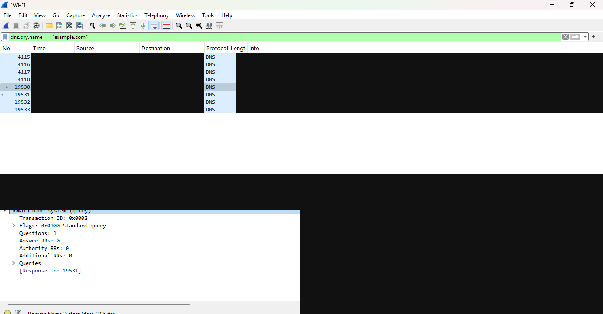
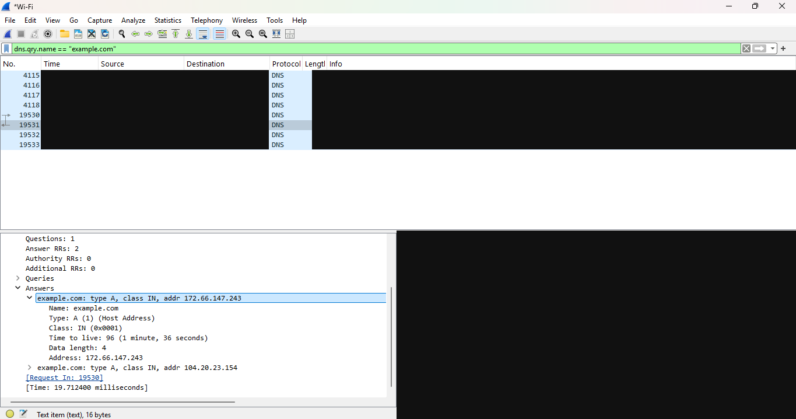
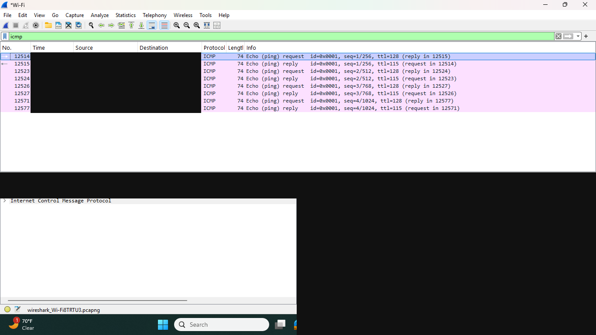
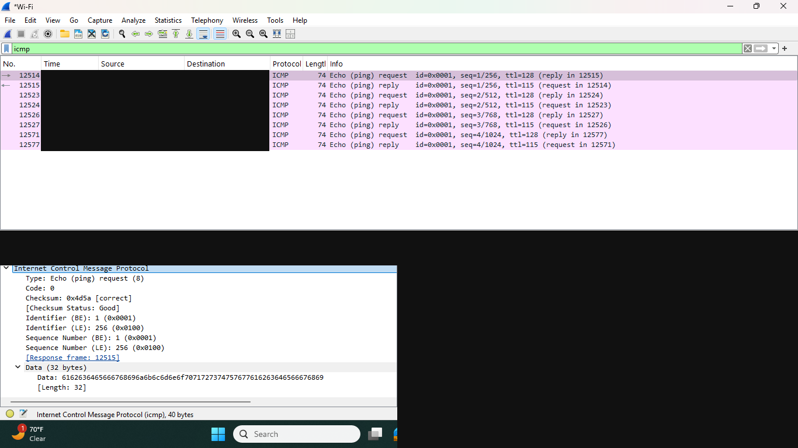
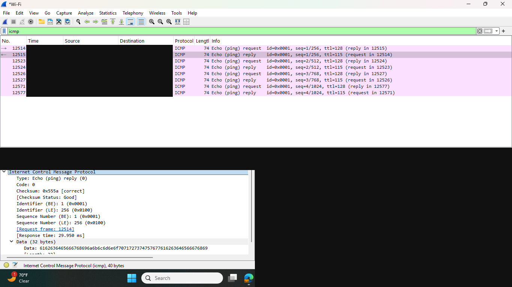
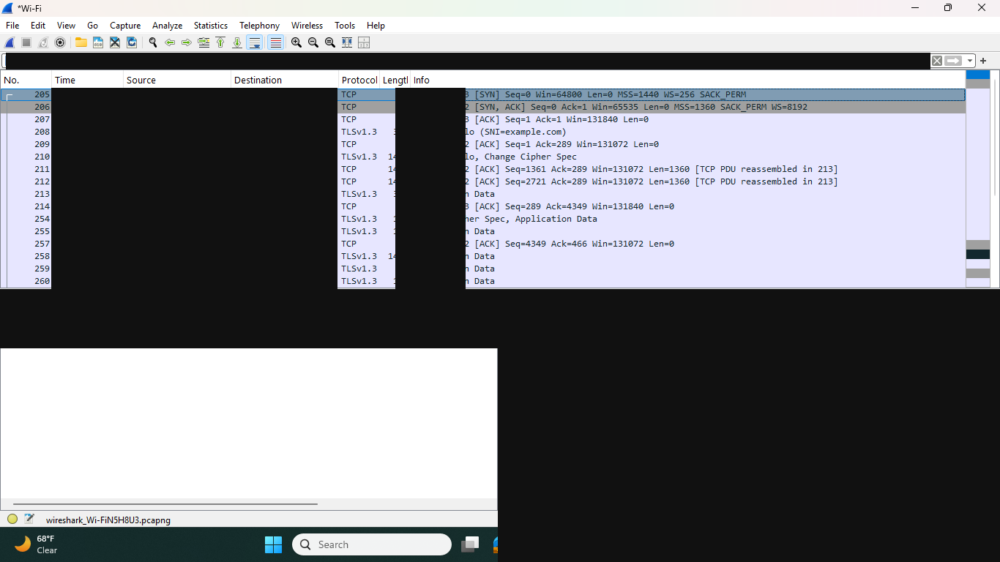
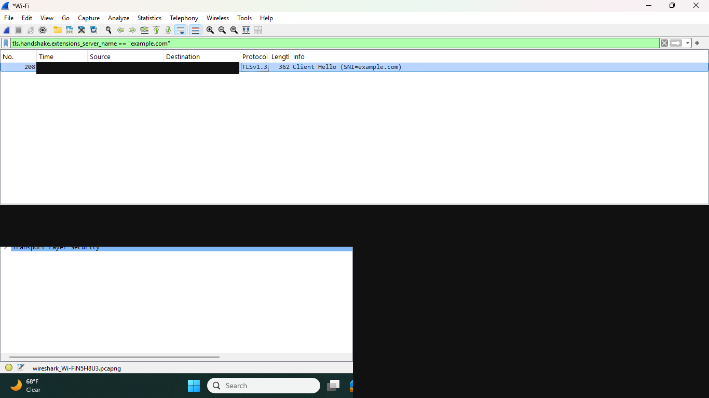
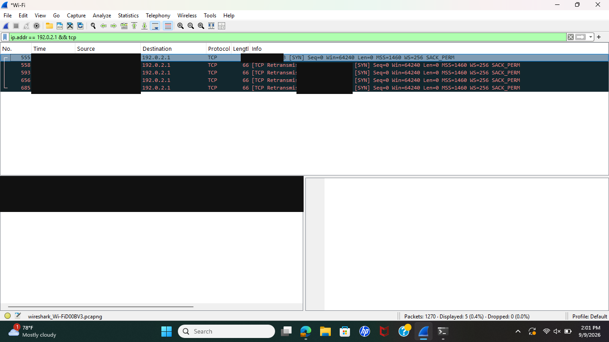

# Wireshark Network Traffic Analysis

I built this project to practice capturing traffic, using display filters, and explaining what happens during common network connections.

The project covers DNS, ICMP, TCP, and TLS. I also compared a successful TCP connection with a failed one to show how Wireshark can help with troubleshooting.

## Tools Used

- Wireshark 4.6.8
- Windows Command Prompt and PowerShell
- `nslookup`
- `ping`
- `curl`
- `Test-NetConnection`

## What I Captured

- DNS A and AAAA queries for `example.com`
- ICMP echo requests and replies to `8.8.8.8`
- A successful TCP three-way handshake
- A TLS 1.3 Client Hello and encrypted traffic
- A failed TCP connection with repeated SYN packets

## Filters Used

```text
dns.qry.name == "example.com"
icmp
tls.handshake.extensions_server_name == "example.com"
ip.addr == 192.0.2.1 && tcp
```

## Main Results

The successful connection completed the SYN, SYN-ACK, ACK handshake before starting TLS. The failed connection sent an initial SYN and four retransmissions but never received a SYN-ACK.

That comparison shows how packet captures can help separate a working connection from a blocked or unreachable destination.

Read my full [analysis](analysis/findings.md).

## Screenshots

### DNS





### ICMP







### Successful TCP and TLS Connection





### Failed TCP Connection



## Privacy

I redacted local addresses, hardware information, temporary client ports, and raw packet bytes before publishing the screenshots. I kept the original packet captures private.
